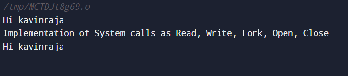

# EX.7-IMPLEMENTATION-OF-SYSTEM-CALLS-READ-WRITE-FORK-OPEN-CLOSE

## AIM:
### C program using open, read, write, close , create , fork() system calls.


## ALGORITHM:
#### 1) Start the program.

#### 2)Open a file for O_RDWR for R/W,O_CREATE for creating a file ,O_TRUNC for truncate a file.

#### 3)Using getchar(), read the character and stored in the string[] array.

#### 4)The string [] array is write into a file close it.

#### 5)Then the first is opened for read only mode and read the characters and displayed it and close the file.

#### 6) Use Fork().

#### 7)Stop the program.

## PROGRAM:
```c
#include<sys/stat.h> 
#include<stdio.h> 
#include<fcntl.h> 
#include<sys/types.h> 
int main() 
{ 
int n,i=0; 
int f1,f2; 
char c,strin[100]; 
f1=open("data",O_RDWR|O_CREAT|O_TRUNC); 
while((c=getchar())!='\n') 
{ 
strin[i++]=c; 
 
} 
strin[i]='\0'; 
write(f1,strin,i); 
close(f1); 
f2=open("data",O_RDONLY); 
read(f2,strin,0); 
printf("\n%s\n",strin); 
close(f2); 
fork(); 
return 0; 
 
}
```
## OUTPUT:



## RESULT:
Thus, open, read, write, close , create , fork() system calls implemented successfully using c program.

